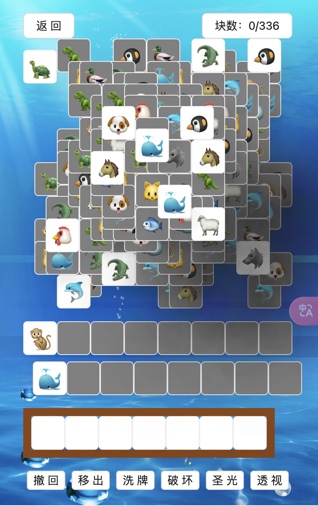
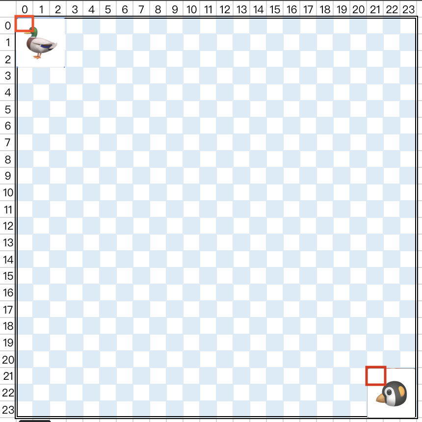
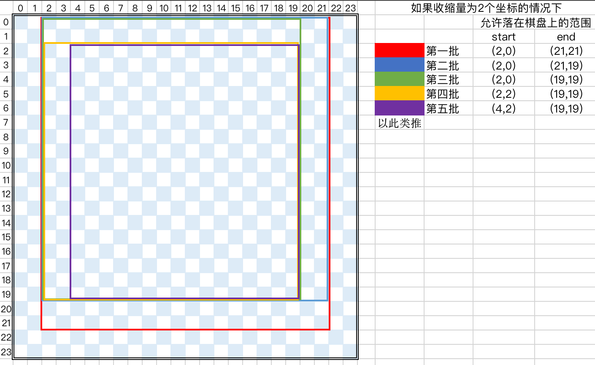

## 本项目是 是对vue3项目 https://github.com/liyupi/yulegeyu 的react搬运
最大的变化的是将vue3项目react化,其次是将核心逻辑拆分,更面向对象化,这样抽离的逻辑更适合搬运到与框架无关的其它项目,比如solid或svelte


### 界面介绍
- 棋盘(层叠区), 最上面的打乱了层级和位置的 block 摆放区
- 随机区,只有一张显示出来的棋子
- 插槽区,棋子点击后放置的位置
- 功能区,各种道具功能

### 名词介绍
- box: 格子,棋盘上的一个格子
- block: 一张图片就是一个块,一个块占 3*3的格子

### 功能区

- 撤回,撤销上一步骤
- 移出,将底部块移出棋盘 todo
- 洗牌,将棋盘中的棋子所在在层级和所在棋盘位置重新随机
- 破坏,从棋盘上随机删掉几个块
- 圣光,棋盘上的下一点击动作无视块所在的层级
- 透视,查看随机区的块

### 核心逻辑说明
- 棋盘和块的坐标点关系,在一个24*24的棋盘上,最左上角坐标为 (0,0)
最右下角坐标为 (23,23),但是一个块,比如途中的鸭子,它的坐标为(0,0),但是它占了3*3的格子,
所以块的最右下角坐标为(21,21)


- 在给所有层叠区的块分批分配坐标关系时,会按批限制块落下的坐标点范围,也就是initGame函数中for循环里的逻辑


### 文件功能介绍
- game.ts: 游戏的所有逻辑协调
- chessBoard.ts: 棋盘的逻辑,只关心棋盘的布局,以及块怎么落在棋盘上
- block-help.ts: 块的生成逻辑,只关心块的生成
- range.ts: 坐标点范围,限制块的坐标落点范围
- slotArea.ts: 插槽区,插槽区的逻辑,消除,撤回,以及游戏输赢的判断

##### 添加shadcn组件功能
```shell
npx shadcn-ui@latest init

✔ Would you like to use TypeScript (recommended)? … yes
✔ Which style would you like to use? › Default
✔ Which color would you like to use as base color? › Slate
✔ Where is your global CSS file? … app/globals.css
✔ Would you like to use CSS variables for colors? … yes
✔ Are you using a custom tailwind prefix eg. tw-? (Leave blank if not) …
✔ Where is your tailwind.config.js located? … tailwind.config.js
✔ Configure the import alias for components: … @/components
✔ Configure the import alias for utils: … @/lib/utils
✔ Are you using React Server Components? … no
✔ Write configuration to components.json. Proceed? … yes

✔ Writing components.json...
✔ Initializing project...
✔ Installing dependencies...

Success! Project initialization completed. You may now add
```